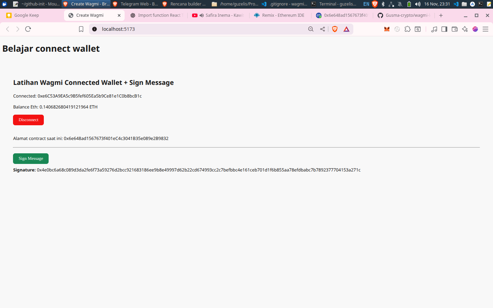

# LATIHAN WAGMI - PROJECT

Ini adalah hasil belajar saya membuat komponen React:


## LATIHAN 1 (WALLET)
1. membuat button connect dan disconnect [done]
2. Menampilkan balance ETH / token [done]
3. Read smart contract (ABI)
4. Write contract (transfer, mint, approve)
5. Connect modal seperti RainbowKit (tanpa install RainbowKit)
6. Integrasi Next.js + Wagmi
7. Login Web3 (Sign Message / SIWE)
8. Multi-chain switch (Ethereum, BSC, Polygon)

## Structure Directory
```css
/src
  /assets          # gambar, icon, styles global, dll
  /components      # UI components reusable & kecil-kecil
    /Button.tsx
    /ConnectWallet.tsx
    /BalanceDisplay.tsx
    /VaultVoting.tsx
    ...
  /hooks           # custom hooks (misal: useTransfer, useVotes, useSignMessage)
    useTransfer.ts
    useVotes.ts
    useSignMessage.ts
    ...
  /pages           # halaman utama / views
    Home.tsx
    Vault.tsx
    ...
  /services        # service/api logic, helper interaksi contract
    contract.ts    # contohnya: ABI, alamat contract, fungsi helper wagmi
    api.ts         # kalau ada backend API calls
  /types           # definisi type TypeScript khusus aplikasi
    wagmi.d.ts
    vault.d.ts
  /utils           # helper function umum (formatting, validation, dll)
  App.tsx
  main.tsx         # entry point vite

/vite.config.ts
/package.json
/tsconfig.json

```

## Penjelasan folder utama

- components/
Komponen UI yang reusable, kecil, fokus satu fungsi. Contoh: tombol, input, card, modal, dsb.

- hooks/
Custom React hooks, terutama yang integrasi dengan wagmi / blockchain, misal hook untuk write contract, read contract, sign message.

- pages/
Struktur halaman (bila kamu pakai routing seperti react-router), atau bisa jadi container component besar yang menggabungkan beberapa komponen.

- services/
Tempat menyimpan logic interaksi blockchain yang bisa dipakai ulang, seperti file yang berisi ABI, alamat contract, helper functions wrapping wagmi calls.

- types/
Semua definisi tipe TypeScript khusus supaya kode lebih kuat typing-nya dan mudah maintenance.

- utils/
Fungsi umum, misalnya format tanggal, konversi token, validasi, dll.